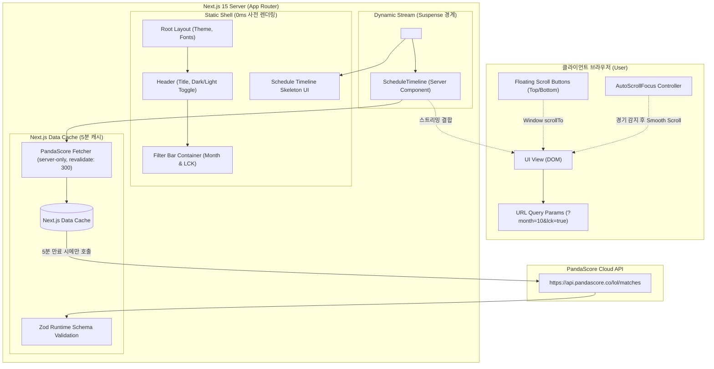

# 📐 시스템 아키텍처 및 설계 명세서 (ARCHITECTURE.md)

이 문서는 2026 롤드컵 일정 서비스의 기술 아키텍처, 렌더링 파이프라인, 캐싱 전략, 런타임 검증 및 컴포넌트 데이터 흐름을 기술합니다. 본 프로젝트는 [RULE.md](./RULE.md)의 모든 프론트엔드 컨벤션을 엄격히 준수합니다.

---

## 1. 시스템 개요 다이어그램



---

## 2. Next.js 15 PPR (Partial Prerendering) 렌더링 파이프라인

본 프로젝트는 Next.js 15의 **PPR(Partial Prerendering)**을 통해 정적 웹의 극한의 속도와 동적 웹의 실시간성을 동시에 확보합니다.

### 2.1 렌더링 분할 구조

1. **정적 쉘 (Static Shell)**
   - 빌드 타임에 완전하게 사전 렌더링되어 정적 HTML로 생성됩니다.
   - 구성: 글로벌 레이아웃, 브랜드 헤더(`header.tsx`), 테마 토글 버튼(`theme-toggle.tsx`), 탭 네비게이션 틀, 스켈레톤 타임라인 UI(`schedule-skeleton.tsx`), 상하단 플로팅 스크롤 버튼(`scroll-floating-buttons.tsx`).
   - 효과: 사용자가 브라우저 주소창을 입력하거나 링크를 클릭했을 때 **TTFB(Time to First Byte) 0ms 수준으로 즉각 화면이 표시**되어 로딩 체감 시간이 거의 없습니다.
2. **동적 스트리밍 (Dynamic Streaming)**
   - 경기 일정 데이터 페칭이 일어나는 핵심 영역은 `<Suspense fallback={<ScheduleSkeleton />}>`으로 격리됩니다.
   - 서버에서 데이터 처리가 완료되는 즉시 브라우저로 청크 단위 스트리밍 전송되어 스켈레톤을 자연스럽게 최신 일정 컴포넌트(`schedule-timeline.tsx`)로 교체합니다.

---

## 3. 데이터 페칭, 보안 및 5분 스마트 캐싱 전략

### 3.1 Server-Only 격리 및 런타임 Zod 검증 (`@/lib/api/pandascore-api.ts`)

PandaScore API 호출은 `import "server-only";`로 클라이언트 번들 유출이 원천 차단되며, `const` 화살표 함수와 Zod 스키마를 통해 안전하게 파싱됩니다.

```typescript
import "server-only";
import { z } from "zod";
import { matchesResponseSchema, type Match } from "@/types/pandascore";

export const get2026WorldsMatches = async (): Promise<Match[]> => {
  const token = process.env.PANDASCORE_API_TOKEN;
  if (!token) {
    throw new Error(
      "PANDASCORE_API_TOKEN is not configured in environment variables",
    );
  }

  const response = await fetch(
    "https://api.pandascore.co/lol/matches?filter[serie_id]=11014&sort=scheduled_at",
    {
      headers: {
        Authorization: `Bearer ${token}`,
        Accept: "application/json",
      },
      next: {
        revalidate: 300, // 5분 (300초) 캐싱
        tags: ["worlds-matches-2026"],
      },
    },
  );

  if (!response.ok) {
    throw new Error(
      `Failed to fetch matches: ${response.status} ${response.statusText}`,
    );
  }

  const rawData: unknown = await response.json();
  const parsed = matchesResponseSchema.safeParse(rawData);

  if (!parsed.success) {
    console.error("Zod Validation Error:", parsed.error.format());
    throw new Error("Invalid match data format received from PandaScore API");
  }

  return parsed.data;
};
```

### 3.2 트래픽 방어 및 보안 원칙

- **트래픽 스파이크 방어**: 수만 명의 사용자가 동시에 사이트에 접속하더라도, Next.js Data Cache 계층에서 5분 동안 동일한 응답을 반환하므로 PandaScore 외부 API 요청은 최대 5분에 1회만 발생합니다.
- **토큰 은닉**: `PANDASCORE_API_TOKEN`은 오직 서버 환경에서만 참조되며, 클라이언트 번들에 노출되지 않아 토큰 탈취 위험이 없습니다.

---

## 4. 데이터 정제 및 도메인 모델

### 4.1 타임존 (KST, UTC+9) 처리 파이프라인 (`@/lib/date/kst-date.ts`)

PandaScore는 모든 일정을 UTC ISO-8601 문자열(`scheduled_at: "2026-10-15T18:00:00Z"`)로 제공합니다.

- `@/lib/date/kst-date.ts`의 유틸리티 함수를 통해 이를 한국 표준시(KST, UTC+9)로 변환합니다.
- **포맷팅 규칙**:
  - 일자 섹션 헤더: `M월 D일 (요일)` (예: `10월 16일 (금)`)
  - 경기 시작 시간: `HH:mm` (예: `03:00`)
- 서버와 클라이언트가 동일한 KST 포맷 함수를 사용하므로 Hydration mismatch 오류가 원천 방지됩니다.

### 4.2 일자별 그룹화 (Grouping)

API에서 가져온 46개의 경기는 다음과 같은 도메인 모델(`type` 별칭)로 변환됩니다.

```typescript
export type GroupedSchedule = {
  dateKey: string; // "2026-10-16"
  formattedDate: string; // "10월 16일 (금)"
  matches: Match[]; // 해당 일자의 경기 목록
};
```

### 4.3 LCK 팀 판별 및 TBD 매치 처리

- **LCK 팀 식별자**: `@/constants/teams.ts`에 정의된 LCK 공식 약칭/슬러그 목록(`['T1', 'GEN', 'HLE', 'DK', 'KT', 'FOX', 'DRX', 'KDF', 'BRO', 'NS']`)을 기준으로 비교합니다.
- **TBD 상태**: 토너먼트 진행 전이나 상위 라운드 진출팀 미확정 시 `opponents: []`입니다.
  - 전체 보기에서는 `TBD vs TBD`로 정상 렌더링됩니다.
  - LCK 필터 활성화 시에는 TBD 매치는 제외되며, 만약 해당 월에 LCK 경기가 아직 확정되지 않았으면 `empty-state.tsx` 컴포넌트를 렌더링합니다.

---

## 5. UI 최적화 및 에셋 관리

### 5.1 이미지 최적화 (`next/image`)

- 팀 로고 및 리그 로고는 `next/image` 컴포넌트로 서빙합니다.
- `next.config.ts`에 PandaScore CDN 도메인을 등록합니다:

```typescript
const nextConfig: NextConfig = {
  experimental: {
    ppr: "incremental",
  },
  images: {
    remotePatterns: [
      {
        protocol: "https",
        hostname: "cdn-api.pandascore.co",
        pathname: "/**",
      },
    ],
  },
};
```

### 5.2 아이콘 및 인라인 SVG 관리

- 인라인 SVG 삽입을 엄격히 금지하며, `lucide-react`를 표준 아이콘으로 사용합니다.
- 롤드컵 트로피 등 커스텀 로고는 `@/components/icons/` 내 `kebab-case.tsx` 파일로 관리합니다.

---

## 6. UI/UX 인터랙션 아키텍처

### 6.1 가장 가까운 다음 경기 자동 포커스 (`@/components/schedule/auto-scroll-focus.tsx`)

1. **타깃 경기 계산 알고리즘**:
   - 현재 시각(KST)을 기준으로, `status === 'running'`인 경기가 있으면 최우선 타깃으로 선정합니다.
   - 진행 중인 경기가 없으면 `status === 'not_started'` 중 `scheduled_at`이 가장 가까운 미래 경기를 선정합니다.
   - 모든 경기가 종료된 경우 마지막 경기(결승전)를 타깃으로 선정합니다.
2. **스크롤 및 강조**:
   - 첫 렌더링 완료 후 해당 경기 카드의 DOM ID (`#match-${match.id}`)를 찾아 `scrollIntoView({ behavior: 'smooth', block: 'center' })`를 호출합니다.
   - 스크롤과 동시에 1.5초 동안 카드 외곽선에 `ring-2 ring-primary ring-offset-2 animate-pulse` 클래스를 부여하여 시각적으로 즉시 인지하도록 돕습니다.

### 6.2 세트별 승패 아코디언 (`@/components/schedule/match-accordion.tsx`)

- 대진 카드를 클릭하면 하단으로 확장되며 세트별 상세 결과(`games` 배열)를 렌더링합니다.
- 각 세트 표시 항목: 세트 번호(Set 1, Set 2...), 세트 상태(예정/진행중/완료), 승리팀 이름/아이콘, 경기 소요 시간(분:초).
- 다중 펼침을 지원하여 사용자가 여러 경기를 동시에 펼쳐두고 비교할 수 있습니다.

### 6.3 상단/하단 스크롤 이동 플로팅 버튼 (`@/components/common/scroll-floating-buttons.tsx`)

- 화면 우측 하단(`fixed bottom-6 right-6 z-50`)에 배치되는 수직 정렬 버튼 그룹.
- 상단 버튼: `window.scrollTo({ top: 0, behavior: 'smooth' })`
- 하단 버튼: `window.scrollTo({ top: document.body.scrollHeight, behavior: 'smooth' })`
- 스크롤 위치에 따라 시각적 피드백 제공.
