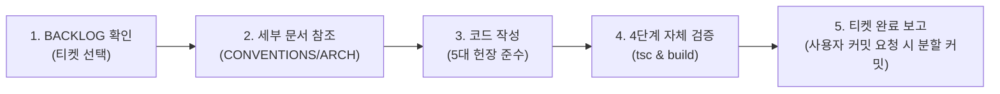

# 🌟 AI 마스터 진입점 및 행동 헌장 (RULE.md)

이 문서는 **AI 에이전트와 개발자가 작업을 시작할 때 항상 가장 먼저 확인해야 하는 최상위 진입점(Master Entrypoint)**입니다.  
본 프로젝트의 모든 작업은 아래의 **5대 핵심 헌장**과 **작업별 라우팅 맵**을 바탕으로 수행됩니다.

---

## ⚡ 1. AI 5대 핵심 헌장 (Core Ground Rules)

어떤 상황에서도 아래 5가지 원칙은 절대 위반할 수 없습니다:

1. **`const` 화살표 함수, Named Export & 서브 컴포넌트 모듈화 필수**
   - 모든 컴포넌트, 유틸리티, 헬퍼는 `const` 화살표 함수로 작성합니다 (`function` 키워드 선언문 일체 금지).
   - Next.js 특수 라우팅 파일(`page.tsx`, `layout.tsx` 등)을 제외한 모든 파일은 Named Export를 사용합니다.
   - **반복 UI 패턴의 분리(DRY)**: 동일/유사한 스타일(Tailwind 클래스 묶음)이나 접근성 속성을 가진 UI 블록(버튼, 배지, 카드 조각 등)이 2회 이상 중복될 경우 인라인 복사 작성을 금지하고, 로컬 서브 컴포넌트(`const SubComponent = ...`) 또는 데이터 매핑(`items.map`)으로 적극 추출합니다.
2. **케밥 케이스(`kebab-case`) 파일/디렉터리 명명**
   - 모든 파일명은 케밥 케이스를 준수합니다 (예: `match-card.tsx`, `pandascore-api.ts`, `kst-date.ts`).
3. **`any` 타입 엄격 금지 & `type` 별칭 우선**
   - `any`는 사용할 수 없으며, 불확실한 동적 데이터는 `unknown` + Zod 스키마 런타임 검증을 적용합니다.
4. **Next.js 15 PPR & 5분 캐시 (`revalidate: 300`) 원칙**
   - Server Component 기본, 민감한 API 호출 파일은 `import "server-only";`로 격리합니다.
   - 외부 PandaScore API는 5분 단위 Next.js Data Cache를 엄격히 적용합니다.
5. **백로그 풀링 준수 및 4단계 검증 (사용자 요청 시에만 커밋 진행)**
   - `BACKLOG.md`에서 한 번에 1개의 티켓만 풀링하여 작업합니다.
   - 포맷 $\rightarrow$ 린트 $\rightarrow$ 타입 검사(`tsc --noEmit`) $\rightarrow$ 빌드(`build`) 4단계 검증을 완료한 후 변경 사항을 보고합니다.
   - **Git 커밋은 임의로 자동 수행하지 않으며, 반드시 사용자가 명시적으로 커밋을 요청했을 때만** 작업 단위별로 분할 커밋(Atomic Commits)을 진행합니다.

---

## 🧭 2. 작업별 문서 라우팅 맵 (Context Routing Map)

작업의 성격에 따라 필요한 세부 문서를 확인한 후 작업을 진행하세요:

| 작업 내용                                       | 열람할 문서                                      | 주요 내용                                                                                                                                                |
| :---------------------------------------------- | :----------------------------------------------- | :------------------------------------------------------------------------------------------------------------------------------------------------------- |
| **코드 작성 / 컴포넌트 구현 / 스타일링**        | 📐 **[docs/CONVENTIONS.md](./CONVENTIONS.md)**   | • 네이밍, 화살표 함수, Named Export • Tailwind CSS, `cn()`, Lucide Icons, `next/image` • Zod 스키마 검증, 4단계 검증 파이프라인, Git 커밋 규약     |
| **시스템 구조 / PPR / 캐싱 / 데이터 흐름 파악** | 🏗️ **[docs/ARCHITECTURE.md](./ARCHITECTURE.md)** | • 시스템 아키텍처 다이어그램 (Mermaid) • PPR Static Shell vs Dynamic Stream 분할 • 5분 캐시 계층, KST(UTC+9) 변환, 자동 스크롤 인터랙션            |
| **다음 작업 티켓 가져오기 / 상태 업데이트**     | 📋 **[docs/BACKLOG.md](./BACKLOG.md)**           | • Phase 0~5 페이즈별 구현 티켓 목록 • 티켓 상태(`TODO` $\rightarrow$ `IN_PROGRESS` $\rightarrow$ `DONE`) • 티켓별 상세 목표 및 Acceptance Criteria |
| **프로젝트 실행 / 환경변수 / API 엔드포인트**   | 📖 **[README.md](../README.md)**                 | • 프로젝트 소개, 로컬 설치 및 실행 명령어 • PandaScore 공식 엔드포인트 및 토큰 설정 가이드                                                            |

---

## 🔄 3. 에이전트 표준 작업 루프 (SOP: Standard Operating Procedure)

AI 에이전트는 사용자의 요청을 처리할 때 아래의 루프를 반복합니다:

1. **[Pull]**: `docs/BACKLOG.md`에서 이전 의존성이 충족된 `[ ] TODO` 티켓을 찾아 상태를 `[-] IN_PROGRESS`로 변경합니다.
2. **[Reference]**: 필요에 따라 `docs/CONVENTIONS.md` 또는 `docs/ARCHITECTURE.md`에서 세부 규칙과 데이터 모델을 확인합니다.
3. **[Implement]**: 5대 핵심 헌장을 준수하여 코드를 작성합니다.
4. **[Verify]**: 터미널에서 `npx tsc --noEmit` 및 `npm run build`를 실행하여 오류가 0개인지 확인합니다.
5. **[Done & Report]**: 티켓 상태를 `[x] DONE`으로 업데이트하고, 4단계 검증 결과와 변경 내역을 사용자에게 보고합니다. **Git 커밋은 임의로 수행하지 않으며, 반드시 사용자가 명시적으로 커밋을 요청했을 때만** 작업 단위별로 분할 커밋(Atomic Commits)합니다.
